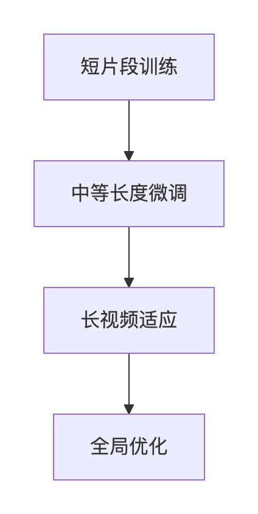

# 目录

- [第一部分：视频生成与视频编辑相关训练与微调技术](#第一部分：视频生成与视频编辑相关训练与微调技术)
  - [1.目前主流的AI视频生成技术框架有哪几种？](#1.目前主流的AI视频生成技术框架有哪几种？)
  - [2.请详细解释视频生成模型的预训练阶段通常采用哪些数据增强策略？这些策略如何影响模型性能？](#2.请详细解释视频生成模型的预训练阶段通常采用哪些数据增强策略？这些策略如何影响模型性能？)
  - [3.当针对特定领域（如体育视频）微调生成模型时，应该采用哪些特殊策略？](#3.当针对特定领域（如体育视频）微调生成模型时，应该采用哪些特殊策略？)
  - [4.如何有效利用文本-视频对数据进行跨模态训练？请说明关键技术点](#4.如何有效利用文本-视频对数据进行跨模态训练？请说明关键技术点)
  - [5.针对长视频生成的训练有哪些特殊技术？如何保证前后一致性？](#5.针对长视频生成的训练有哪些特殊技术？如何保证前后一致性？)
  - [6.视频编辑模型中"保持原始内容"与"实现编辑目标"如何平衡？](#6.视频编辑模型中"保持原始内容"与"实现编辑目标"如何平衡？)
  - [7.在有限数据情况下如何有效训练视频编辑模型？](#7.在有限数据情况下如何有效训练视频编辑模型？)
- [第二部分：视频理解相关训练与微调技术](#第二部分：视频理解相关训练与微调技术)


<h1 id="第一部分：视频生成与视频编辑相关训练与微调技术">第一部分：视频生成与视频编辑相关训练与微调技术</h1>

<h2 id="1.目前主流的AI视频生成技术框架有哪几种？">1.目前主流的AI视频生成技术框架有哪几种？</h2>

Rocky梳理总结了AIGC时代到目前为止主流的AI视频技术框架，市面上的所有AI视频产品基本上都是基于以下这些框架：
1. 文本生成视频：输入文本，先生成图片或者直接生成视频。主要流程包括工作流前处理+扩散模型+运动模块+条件控制+工作流后处理。
2. 图像生成视频：输入图像，先生成前后帧图像，然后使用插帧与语义扩展持续生成前后序列帧图像，最后生成完整视频。主要流程包括工作流前处理+扩散模型+运动模块+条件控制+工作流后处理。
3. 视频生成视频：输入视频，提取关键帧，对关键帧进行转绘，然后再进行插帧，从而生成新的视频。主要流程包括工作流前处理+扩散模型+运动模块+条件控制+工作流后处理。


<h2 id="2.请详细解释视频生成模型的预训练阶段通常采用哪些数据增强策略？这些策略如何影响模型性能？">2.请详细解释视频生成模型的预训练阶段通常采用哪些数据增强策略？这些策略如何影响模型性能？</h2>

视频生成预训练中的数据增强策略可分为三类：
- 时序增强：
  - 帧采样抖动（±3帧随机偏移）
  - 反向播放序列（提升双向建模能力）
  - 变速处理（0.8x-1.2x速度变化）
  
  影响：增强模型对运动规律的理解能力，但过度增强可能导致动作失真

- 空间增强：
  - 弹性形变（模拟非刚性运动）
  - 光照抖动（±15%亮度变化）
  - 区域遮挡（最高20%面积）

  影响：提升模型对遮挡和光照变化的鲁棒性，但可能损失细节精度

- 语义增强：
  - 文本提示改写（同义替换）
  - 动作描述泛化（"行走"→"漫步"）
  - 多语言标签对齐
  
  影响：改善文本-视频对齐能力，但需要控制避免语义漂移


<h2 id="3.当针对特定领域（如体育视频）微调生成模型时，应该采用哪些特殊策略？">3.当针对特定领域（如体育视频）微调生成模型时，应该采用哪些特殊策略？</h2>

1. 数据层面：
   - 运动轨迹强化（增加球类/运动员跟踪标注）
   - 关键帧提取（得分时刻优先采样）
   - 多机位数据对齐
2. 架构调整：
   - 运动注意力机制（增加轨迹预测头）
   - 物理约束模块（抛物线运动先验）
   - 高速运动专用编码器（处理运动模糊）
3. 训练技巧：
```python
# 典型体育视频训练代码片段
def sports_loss(video_pred, video_gt):
    optical_flow_loss = RAFT_loss(pred_flow, gt_flow)
    trajectory_loss = L1(track_pred, track_gt)
    temporal_consistency = 1 - SSIM(consecutive_frames)
    return 0.6*optical_flow_loss + 0.3*trajectory_loss + 0.1*temporal_consistency
```
4. 评估侧重：
   - 运动轨迹准确性（TO指标）
   - 高速动作清晰度（BSI评分）
   - 规则符合度（如篮球走步检测）


<h2 id="4.如何有效利用文本-视频对数据进行跨模态训练？请说明关键技术点">4.如何有效利用文本-视频对数据进行跨模态训练？请说明关键技术点</h2>

1. 表示对齐：
   - 对比学习框架（CLIP风格）
   - 多粒度注意力（词-帧/句-片段）
   - 解耦表示（内容/风格分离）
2. 训练策略：
   - 课程学习（简单→复杂描述）
   - 难样本挖掘（聚焦错误对齐对）
   - 多任务协同（生成+检索）
3. 数据工程：
   - 描述文本规范化（动词标准化）
   - 时间戳对齐验证
   - 噪声过滤（自动清洗低质量对）
4. 典型问题解决：
   - 时序错位：使用DTW算法对齐文本-视频序列
   - 语义鸿沟：引入视觉概念词典作为桥梁
   - 模态不平衡：动态调整损失权重


<h2 id="5.针对长视频生成的训练有哪些特殊技术？如何保证前后一致性？">5.针对长视频生成的训练有哪些特殊技术？如何保证前后一致性？</h2>

1. 记忆机制：
   - 关键帧记忆库（每50帧存储参考帧）
   - 特征缓存重用（节省50%计算量）
   - 全局状态向量（跨片段传递）
2. 分层训练：

3. 一致性保障：
   - 光流约束损失（FlowNet2基准）
   - 内容锚点（每N帧强制对齐）
   - 时序判别器（检测不连贯）
4. 资源优化：
   - 片段交错训练
   - 梯度检查点技术
   - 动态分辨率策略
5. 评估指标创新：
   - 长期依赖得分（LDS）
   - 情节连贯性（ECI）
   - 角色一致性（CCI）


<h2 id="6.视频编辑模型中"保持原始内容"与"实现编辑目标"如何平衡？">6.视频编辑模型中"保持原始内容"与"实现编辑目标"如何平衡？</h2>

1. 空间控制：
   - 注意力掩码（保护非编辑区）
   - 深度感知编辑（前景/背景分层）
   - 关键点锁定（如面部特征点）
2. 时序控制：
   - 编辑传播算法（双向传播）
   - 运动保持损失（光流相似度）
   - 关键帧约束（首尾帧强制匹配）
3. 语义平衡：
   - 对比编辑提示（"保持X的同时改变Y"）
   - 属性解耦编辑（StyleSpace操作）
   - 基于扩散的渐进编辑
4. 典型工作流程：
   - 分析视频内容结构
   - 生成编辑操作热图
   - 计算受影响区域
   - 分层应用修改
   - 时空一致性后处理


<h2 id="7.在有限数据情况下如何有效训练视频编辑模型？">7.在有限数据情况下如何有效训练视频编辑模型？</h2>

1. 数据效率技术：
   - 合成数据生成（游戏引擎渲染）
   - 跨域迁移（图片→视频知识迁移）
   - 元学习（MAML框架）
2. 模型设计：
   轻量级架构（MobileViT变体）
   共享参数设计（90%参数共享）
   混合专家（条件路由）
3. 训练优化：
```python
# 低资源训练伪代码
for epoch in range(epochs):
    apply_dynamic_augmentation()  # 动态增强
    use_consistency_regularization()  # 一致性约束
    update_ema_model()  # 模型平均
    if is_high_loss_sample():
        add_to_memory_bank()  # 难样本记忆
```
4. 评估策略：
   - 小样本适应测试（5-shot评估）
   - 泛化能力度量（跨域测试）
   - 编辑精度/保持率平衡


<h1 id="第二部分：视频理解相关训练与微调技术">第二部分：视频理解相关训练与微调技术</h1>
